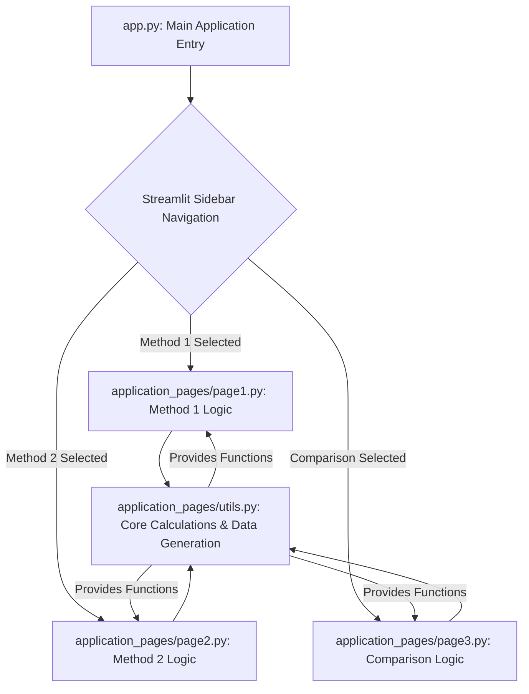

id: 688ccd851cce570d6eb949a1_documentation
summary: ECB-Annex Documentation
feedback link: https://docs.google.com/forms/d/e/1FAIpQLSfWkOK-in_bMMoHSZfcIvAeO58PAH9wrDqcxnJABHaxiDqhSA/viewform?usp=sf_link
environments: Web
status: Published
# QuLab: Understanding Monte Carlo Error in Counterparty Credit Risk (ECB-Annex)

## 1. Introduction to QuLab: ECB-Annex Lab & Monte Carlo Error Estimation
Duration: 00:07:00

Welcome to the **QuLab: ECB-Annex Lab** codelab! This interactive Streamlit application serves as a powerful educational tool to demystify and implement crucial concepts in **counterparty credit risk** estimation, specifically focusing on **Monte Carlo (MC) error of Expected Positive Exposure (EEPE)**.

In financial institutions, especially within the context of regulatory frameworks like the European Central Bank (ECB) Annex requirements, accurate measurement and understanding of exposure are paramount. **Expected Positive Exposure (EEPE)** is a key metric representing the average positive exposure over a future time horizon, weighted by its probability of occurrence. It's a critical input for calculating Credit Valuation Adjustment (CVA) and assessing potential future losses from counterparty default.

Monte Carlo simulations are widely used to estimate EEPE due to the complexity of underlying risk factors. However, like all simulation methods, MC simulations introduce **sampling error**, also known as Monte Carlo error. Quantifying this error is essential for:
*   **Regulatory Compliance:** Regulators often require financial institutions to demonstrate the precision of their risk models.
*   **Risk Management:** Understanding the uncertainty around EEPE estimates helps in setting appropriate capital reserves and risk limits.
*   **Model Validation:** It allows for assessing the stability and reliability of the simulation process.
*   **Resource Allocation:** Knowing when an estimate is sufficiently precise helps in optimizing computational resources for simulations.

This application provides a hands-on environment to:
*   Understand and implement two distinct methodologies for calculating $\text{error}(\text{EEPE})$.
*   Visualize how simulation parameters like the number of Monte Carlo runs ($m$) and scenarios ($N$) impact error estimates.
*   Compare the characteristics and sensitivities of Method 1 and Method 2.
*   Illustrate the importance of the convergence adjustment factor.

### Application Architecture

The QuLab application is structured modularly using Streamlit, Python, NumPy, and Plotly. Here's a high-level overview of its components:



*   `app.py`: The main entry point, handling navigation and providing the overall application structure.
*   `application_pages/utils.py`: Contains all core mathematical functions for synthetic data generation, variance calculations, and error computations shared across the different methods.
*   `application_pages/page1.py`: Implements the UI and logic for "Method 1" of EEPE Monte Carlo error estimation.
*   `application_pages/page2.py`: Implements the UI and logic for "Method 2" of EEPE Monte Carlo error estimation.
*   `application_pages/page3.py`: Implements the UI and logic for comparing both methods.

### Setting Up and Running the Application

To run this application, you'll need Python installed on your system, along with a few libraries.

<aside class="positive">
It's recommended to create a virtual environment to manage dependencies.
</aside>

1.  **Clone the Repository (or create files):**
    If you have the code as separate files, ensure they are in the correct directory structure:
    ```
    .
    ├── app.py
    └── application_pages/
        ├── __init__.py
        ├── page1.py
        ├── page2.py
        ├── page3.py
        └── utils.py
    ```

2.  **Install Dependencies:**
    Open your terminal or command prompt and navigate to the root directory where `app.py` is located. Then install the required libraries:

    ```console
    pip install streamlit numpy plotly
    ```

3.  **Run the Streamlit Application:**
    From the same directory in your terminal, execute:

    ```console
    streamlit run app.py
    ```

    This command will open the Streamlit application in your default web browser. You can now interact with the sliders and observe the real-time calculations and visualizations.

## 2. Understanding the Core Utility Functions (`utils.py`)
Duration: 00:10:00

The `utils.py` file is the backbone of the QuLab application, housing all the fundamental mathematical operations required for both Monte Carlo error estimation methods. Understanding these functions is crucial for grasping how the errors are calculated.

Let's break down the key functions:

### Synthetic Data Generation

Since we don't have real-time exposure data for this lab, we generate synthetic data to simulate `EEPE^k` values (for Method 1) and `D_j` values (for Method 2).

*   **`generate_synthetic_eepe_k_data(m_runs, mean, std_dev)`:**
    This function simulates `m_runs` independent observations of $\text{EEPE}^k$. Each $\text{EEPE}^k$ represents an EEPE value derived from a complete Monte Carlo simulation run. The values are drawn from a normal distribution specified by `mean` and `std_dev`.

    ```python
    import numpy as np

    def generate_synthetic_eepe_k_data(m_runs, mean, std_dev):
        """Generates synthetic EEPE^k data."""
        if std_dev < 0:
            raise ValueError("Standard deviation cannot be negative.")
        if m_runs == 0:
            return np.array([])
        return np.random.normal(mean, std_dev, m_runs)
    ```

*   **`generate_synthetic_dj_data(N_scenarios, mean, std_dev)`:**
    This function simulates `N_scenarios` individual discounted positive exposure values, $D_j$. In a real-world scenario, $D_j = \max(0, \text{discounted future exposure})$. Here, $D_j$ values are drawn from a normal distribution with `mean` and `std_dev`, and then floored at 0 (since exposure cannot be negative).

    ```python
    import numpy as np

    def generate_synthetic_dj_data(N_scenarios, mean, std_dev):
        """Generates synthetic Dj values."""
        if std_dev < 0:
            raise ValueError("Standard deviation cannot be negative.")
        if N_scenarios == 0:
            return np.array([])
        data = np.random.normal(mean, std_dev, N_scenarios)
        data[data < 0] = 0 # Ensure positive exposures
        return data
    ```

### Variance Calculations

Both methods rely on calculating a variance measure as a core component of the error estimation.

*   **`calculate_var_m1(eepe_k_values)`:**
    Calculates the sample variance of the `EEPE^k` values. This variance reflects the variability of the EEPE estimates across different independent simulation runs.

    $$ \text{var}_{m1}(\text{EEPE}) = \frac{1}{m-1} \sum_{k=1}^{m} (\text{EEPE}^k - \overline{\text{EEPE}})^2 $$

    ```python
    import numpy as np

    def calculate_var_m1(eepe_k_values):
        """Computes the variance of EEPE based on Method 1."""
        return np.var(eepe_k_values) # NumPy's var function computes sample variance by default for len > 1
    ```

*   **`calculate_var_m2(dj_values)`:**
    Calculates the sample variance of the $D_j$ values. This variance directly reflects the dispersion of individual discounted positive exposures.

    $$ \text{var}_{m2}(\text{EEPE}) = \frac{1}{N} \sum_{j=1}^{N} (D_j - \bar{D})^2 $$
    Note: The implementation uses `sum([(x - mean) ** 2 for x in dj_values]) / n` which is the population variance. For sample variance, it would typically be `(n-1)`. The application uses the form specified in the original problem context for Method 2 variance calculation.

    ```python
    def calculate_var_m2(dj_values):
        """Computes the variance of EEPE based on Method 2."""
        n = len(dj_values)
        if n <= 1:
            return 0.0 # Variance is zero or undefined for 0 or 1 data points
        mean = sum(dj_values) / n
        variance = sum([(x - mean) ** 2 for x in dj_values]) / n
        return variance
    ```

### Convergence Adjustment Factor (Method 1 Specific)

*   **`calculate_conv_adj(m_val)`:**
    This is a critical component for Method 1. The convergence adjustment factor, $\text{convAdj}(m)$, accounts for the fact that when the number of Monte Carlo runs ($m$) is small, the sample mean might not be a perfectly reliable estimate of the true mean. It uses quantiles from the Student's t-distribution, which is more appropriate for small sample sizes, divided by $\sqrt{m}$. As $m$ becomes large, the t-distribution approaches the normal distribution, and the t-quantile approaches $\Phi^{-1}(0.975)$.

    $$ \text{convAdj}(m) = \frac{t_{m-1, 0.975}}{\sqrt{m}} $$

    ```python
    import math

    phi_inv_0_975 = 1.96 # Z-score for 97.5th percentile (for 95% confidence interval)

    def calculate_conv_adj(m_val):
        """Computes the convergence adjustment factor for Method 1."""
        if m_val <= 1:
            return float('inf') if m_val == 1 else 0.0
        t_quantile = { # Predefined t-quantiles for specific degrees of freedom
            2: 12.706,
            50: 2.009,
            100: 1.984,
            1000: 1.962
        }
        if m_val in t_quantile:
            adj_factor = t_quantile[m_val] / math.sqrt(m_val)
        else:
            # Approximation for larger m, t-distribution approaches normal (1.96)
            adj_factor = 1.96 / math.sqrt(m_val)
        return adj_factor
    ```

### Final Error Calculations

*   **`calculate_error_m1(var_m1, conv_adj_val, phi_inv_0_975)`:**
    Combines the variance, convergence adjustment, and the standard normal quantile to compute the final Monte Carlo error for Method 1. The $\Phi^{-1}(0.975)$ value (1.96) is used to define a 95% confidence interval (i.e., the error represents half the width of a 95% confidence interval around the EEPE estimate).

    $$ \text{error}_{m1}(\text{EEPE}) = \sqrt{\text{var}_{m1}(\text{EEPE})} \times \text{convAdj}(m) \times \Phi^{-1}(0.975) $$

    ```python
    def calculate_error_m1(var_m1, conv_adj_val, phi_inv_0_975):
        """Computes the final Monte Carlo error for Method 1."""
        error_m1 = (var_m1**0.5) * conv_adj_val * phi_inv_0_975
        return error_m1
    ```

*   **`calculate_error_m2(var_m2, phi_inv_0_975)`:**
    Computes the Monte Carlo error for Method 2, using the variance of $D_j$ values and the standard normal quantile.

    $$ \text{error}_{m2}(\text{EEPE}) = \sqrt{\text{var}_{m2}(\text{EEPE})} \times \Phi^{-1}(0.975) $$

    ```python
    def calculate_error_m2(var_m2, phi_inv_0_975):
        """Computes the final Monte Carlo error for Method 2."""
        error_m2 = phi_inv_0_975 * (var_m2**0.5)
        return error_m2
    ```

<aside class="positive">
The constant `phi_inv_0_975 = 1.96` is the Z-score corresponding to the 97.5th percentile of a standard normal distribution. This value is fundamental for constructing a 95% confidence interval for the estimated EEPE, assuming a sufficiently large number of samples for the Central Limit Theorem to apply.
</aside>

## 3. Exploring Method 1: EEPE Monte Carlo Error Estimation (`page1.py`)
Duration: 00:15:00

The "Method 1" page in QuLab focuses on calculating the Monte Carlo error of EEPE by considering multiple independent Monte Carlo simulation runs ($\text{EEPE}^k$). This method treats each $\text{EEPE}^k$ as a data point and estimates the error based on the variability of these points.

### Conceptual Basis

Method 1's formula for the Monte Carlo error of EEPE is:

$$ \text{error}_{m1}(\text{EEPE}) = \sqrt{\text{var}_{m1}(\text{EEPE})} \times \text{convAdj}(m) \times \Phi^{-1}(0.975) $$

Where:
*   $\text{var}_{m1}(\text{EEPE})$ is the sample variance of $m$ independent $\text{EEPE}^k$ values.
*   $\text{convAdj}(m)$ is the convergence adjustment factor, crucial for smaller $m$ values, calculated as $\frac{t_{m-1, 0.975}}{\sqrt{m}}$. This factor accounts for the uncertainty when estimating the variance from a limited number of samples using the Student's t-distribution.
*   $\Phi^{-1}(0.975)$ is the 97.5th percentile of the standard normal distribution (1.96), used for a 95% confidence interval.

### User Interface and Parameters

The Streamlit sidebar for Method 1 provides several interactive sliders:

*   **Synthetic Data Mean (μ):** Controls the average value of the generated synthetic $\text{EEPE}^k$ data. (Range: 1-500, Default: 100)
*   **Synthetic Data Volatility (σ):** Controls the standard deviation of the generated synthetic $\text{EEPE}^k$ data, impacting the variability. (Range: 1-100, Default: 10)
*   **Number of MC Runs for Calculations (m):** This is the core parameter for Method 1. It represents the number of independent simulations ($\text{EEPE}^k$) used to calculate the error. (Range: 2-1000, Default: 50)
*   **Max M for Convergence Plot:** Sets the upper limit for the $m$-axis on the convergence plots, allowing you to observe the error behavior over a wider range of $m$. (Range: 20-5000, Default: 1000)

### Code Walkthrough (`application_pages/page1.py`)

```python
import streamlit as st
import numpy as np
import plotly.graph_objects as go
from application_pages.utils import (
    phi_inv_0_975,
    generate_synthetic_eepe_k_data,
    calculate_var_m1,
    calculate_conv_adj,
    calculate_error_m1
)

def run_page1():
    st.title("Method 1: EEPE Monte Carlo Error Estimation")
    st.markdown("""
    Method 1 calculates the Monte Carlo error of EEPE based on multiple independent Monte Carlo runs.
    The formula for the error is:
    $$ \text{error}_{m1}(\text{EEPE}) = \sqrt{\text{var}_{m1}(\text{EEPE})} \times \text{convAdj}(m) \times \Phi^{-1}(0.975) $$
    where $\text{var}_{m1}(\text{EEPE})$ is the sample variance of $\text{EEPE}^k$ values, and $\text{convAdj}(m)$ is the convergence adjustment factor:
    $$ \text{convAdj}(m) = \frac{t_{m-1, 0.975}}{\sqrt{m}} $$
    """)

    st.sidebar.header("Method 1 Parameters")
    # Sliders for user input
    synthetic_mean = st.sidebar.slider(
        "Synthetic Data Mean (μ)", min_value=1, max_value=500, value=100, step=1,
        help="Sets the average value for the generated synthetic EEPE or exposure data."
    )
    synthetic_volatility = st.sidebar.slider(
        "Synthetic Data Volatility (σ)", min_value=1, max_value=100, value=10, step=1,
        help="Sets the variability (standard deviation) of the generated synthetic EEPE or exposure data."
    )
    m_runs = st.sidebar.slider(
        "Number of MC Runs for Calculations (m)", min_value=2, max_value=1000, value=50, step=1,
        help="Number of Monte Carlo runs ($m$) used to estimate $\text{EEPE}^k$ for Method 1."
    )
    conv_adj_plot_max_m = st.sidebar.slider(
        "Max M for Convergence Plot", min_value=20, max_value=5000, value=1000, step=10,
        help="Sets the upper limit for the 'Number of MC Runs ($m$)' axis in Method 1 convergence plots."
    )

    # Calculate and display single error value based on current slider settings
    eepe_k_data = generate_synthetic_eepe_k_data(m_runs, synthetic_mean, synthetic_volatility)
    if eepe_k_data.size > 1:
        var_m1_val = calculate_var_m1(eepe_k_data)
        conv_adj_val = calculate_conv_adj(m_runs)
        error_m1_val = calculate_error_m1(var_m1_val, conv_adj_val, phi_inv_0_975)
        st.markdown(f"**Calculated $\text{{error}}_{{m1}}(\text{{EEPE}})$ for $m={m_runs}$:  {error_m1_val:.4f}**")
    else:
        st.write("Not enough data to calculate error for Method 1. Increase 'Number of MC Runs'.")
        error_m1_val = 0.0

    st.divider()

    # Plot 1: Method 1 EEPE Monte Carlo Error vs. Number of MC Runs (m)
    st.subheader("Method 1: EEPE Monte Carlo Error vs. Number of MC Runs ($m$)")
    m_values_plot = np.arange(2, conv_adj_plot_max_m + 1, max(1, conv_adj_plot_max_m // 100))
    errors_m1_plot = []
    for m in m_values_plot:
        data_for_plot = generate_synthetic_eepe_k_data(m, synthetic_mean, synthetic_volatility)
        if data_for_plot.size > 1:
            var_m1_plot = calculate_var_m1(data_for_plot)
            conv_adj_plot = calculate_conv_adj(m)
            errors_m1_plot.append(calculate_error_m1(var_m1_plot, conv_adj_plot, phi_inv_0_975))
        else:
            errors_m1_plot.append(0.0)

    fig_m1_error = go.Figure(data=go.Scatter(x=m_values_plot, y=errors_m1_plot, mode='lines'))
    fig_m1_error.update_layout(
        title='Method 1: EEPE Monte Carlo Error vs. Number of MC Runs ($m$)',
        xaxis_title='Number of MC Runs ($m$)',
        yaxis_title='Calculated $\text{error}_{m1}(\text{EEPE})$'
    )
    st.plotly_chart(fig_m1_error, use_container_width=True)

    st.divider()

    # Plot 2: Impact of m on Convergence Adjustment Factor
    st.subheader("Impact of $m$ on Convergence Adjustment Factor")
    conv_adj_values_plot = [calculate_conv_adj(m) if m > 1 else 0.0 for m in m_values_plot]
    
    fig_conv_adj = go.Figure(data=go.Scatter(x=m_values_plot, y=conv_adj_values_plot, mode='lines'))
    fig_conv_adj.update_layout(
        title='Impact of m on Convergence Adjustment Factor',
        xaxis_title='Number of MC Runs ($m$)',
        yaxis_title='Convergence Adjustment Factor ($\text{convAdj}(m)$)'
    )
    st.plotly_chart(fig_conv_adj, use_container_width=True)
```

### Key Observations

*   **Error Convergence:** The first plot, "Method 1: EEPE Monte Carlo Error vs. Number of MC Runs ($m$)", demonstrates that as the number of MC runs ($m$) increases, the calculated $\text{error}_{m1}(\text{EEPE})$ generally decreases. This illustrates the fundamental principle of Monte Carlo simulation: increasing the number of samples improves the precision of the estimate.
*   **Convergence Adjustment Factor:** The second plot, "Impact of $m$ on Convergence Adjustment Factor", shows how $\text{convAdj}(m)$ decreases rapidly as $m$ increases, especially for smaller $m$. This factor is critical for providing a more robust error estimate when the number of independent simulation runs is limited. For very large $m$, $\text{convAdj}(m)$ approaches $1.96/\sqrt{m}$, demonstrating the convergence towards the normal approximation.

<aside class="negative">
If `m_runs` is set to 0 or 1, the variance is undefined or zero, leading to an inability to calculate a meaningful error. The application handles this by displaying a warning.
</aside>

Experiment with the sliders to see how the mean and volatility of the synthetic data, as well as the number of MC runs, directly influence the calculated error and its convergence.

## 4. Exploring Method 2: EEPE Monte Carlo Error Estimation (`page2.py`)
Duration: 00:15:00

The "Method 2" page in QuLab provides an alternative approach to estimating the Monte Carlo error of EEPE. Unlike Method 1, which relies on multiple independent EEPE estimates, Method 2 directly uses the variance of individual discounted positive exposures ($D_j$) from a single, large Monte Carlo simulation.

### Conceptual Basis

Method 2's formula for the Monte Carlo error of EEPE is simpler as it doesn't require a convergence adjustment factor specific to the number of outer runs.

$$ \text{error}_{m2}(\text{EEPE}) = \sqrt{\text{var}_{m2}(\text{EEPE})} \times \Phi^{-1}(0.975) $$

Where:
*   $\text{var}_{m2}(\text{EEPE})$ is the sample variance of the $D_j$ values:
    $$ \text{var}_{m2}(\text{EEPE}) = \frac{1}{N} \sum_{j=1}^{N} (D_j - \bar{D})^2 $$
    Here, $D_j$ represents the discounted positive exposure for the $j$-th scenario, and $\bar{D}$ is the mean of all $N$ scenarios.
*   $\Phi^{-1}(0.975)$ is the 97.5th percentile of the standard normal distribution (1.96), used for a 95% confidence interval.

### User Interface and Parameters

The Streamlit sidebar for Method 2 also provides interactive sliders:

*   **Synthetic Data Mean (μ):** Controls the average value of the generated synthetic $D_j$ data. (Range: 1-500, Default: 100)
*   **Synthetic Data Volatility (σ):** Controls the standard deviation of the generated synthetic $D_j$ data, impacting the variability. (Range: 1-100, Default: 10)
*   **Number of Scenarios for Calculations (N):** This is the core parameter for Method 2. It represents the number of individual scenarios ($D_j$) used to calculate the error. (Range: 100-100000, Default: 10000)
*   **Max N for Convergence Plot:** Sets the upper limit for the $N$-axis on the convergence plot, allowing you to observe the error behavior over a wider range of $N$. (Range: 1000-1000000, Default: 100000)

### Code Walkthrough (`application_pages/page2.py`)

```python
import streamlit as st
import numpy as np
import plotly.graph_objects as go
from application_pages.utils import (
    phi_inv_0_975,
    generate_synthetic_dj_data,
    calculate_var_m2,
    calculate_error_m2
)

def run_page2():
    st.title("Method 2: EEPE Monte Carlo Error Estimation")
    st.markdown("""
    Method 2 calculates the Monte Carlo error of EEPE based on the variance of individual discounted positive exposures $D_j$.
    The formula for the error is:
    $$ \text{error}_{m2}(\text{EEPE}) = \sqrt{\text{var}_{m2}(\text{EEPE})} \times \Phi^{-1}(0.975) $$
    where $\text{var}_{m2}(\text{EEPE})$ is the sample variance of $D_j$ values:
    $$ \text{var}_{m2}(\text{EEPE}) = \frac{1}{N} \sum_{j=1}^{N} (D_j - \bar{D})^2 $$
    and $D_j = \max(0, X_j)$ where $X_j \sim \mathcal{N}(\mu, \sigma^2)$.
    """)

    st.sidebar.header("Method 2 Parameters")
    # Sliders for user input
    synthetic_mean = st.sidebar.slider(
        "Synthetic Data Mean (μ)", min_value=1, max_value=500, value=100, step=1,
        help="Sets the average value for the generated synthetic EEPE or exposure data."
    )
    synthetic_volatility = st.sidebar.slider(
        "Synthetic Data Volatility (σ)", min_value=1, max_value=100, value=10, step=1,
        help="Sets the variability (standard deviation) of the generated synthetic EEPE or exposure data."
    )
    N_scenarios = st.sidebar.slider(
        "Number of Scenarios for Calculations (N)", min_value=100, max_value=100000, value=10000, step=100,
        help="Number of scenarios ($N$) used to generate $D_j$ values for Method 2."
    )
    N_plot_max_N = st.sidebar.slider(
        "Max N for Convergence Plot", min_value=1000, max_value=1000000, value=100000, step=1000,
        help="Sets the upper limit for the 'Number of Scenarios ($N$)' axis in Method 2 convergence plots."
    )

    # Calculate and display single error value based on current slider settings
    dj_data = generate_synthetic_dj_data(N_scenarios, synthetic_mean, synthetic_volatility)
    if dj_data.size > 1:
        var_m2_val = calculate_var_m2(dj_data)
        error_m2_val = calculate_error_m2(var_m2_val, phi_inv_0_975)
        st.markdown(f"**Calculated $\text{{error}}_{{m2}}(\text{{EEPE}})$ for $N={N_scenarios}$: {error_m2_val:.4f}**")
    else:
        st.write("Not enough data to calculate error for Method 2. Increase 'Number of Scenarios'.")
        error_m2_val = 0.0

    st.divider()

    # Plot: Method 2 EEPE Monte Carlo Error vs. Number of Scenarios (N)
    st.subheader("Method 2: EEPE Monte Carlo Error vs. Number of Scenarios ($N$)")
    N_values_plot = np.arange(100, N_plot_max_N + 1, max(100, N_plot_max_N // 100))
    errors_m2_plot = []
    for N in N_values_plot:
        data_for_plot = generate_synthetic_dj_data(N, synthetic_mean, synthetic_volatility)
        if data_for_plot.size > 1:
            var_m2_plot = calculate_var_m2(data_for_plot)
            errors_m2_plot.append(calculate_error_m2(var_m2_plot, phi_inv_0_975))
        else:
            errors_m2_plot.append(0.0)

    fig_m2_error = go.Figure(data=go.Scatter(x=N_values_plot, y=errors_m2_plot, mode='lines'))
    fig_m2_error.update_layout(
        title='Method 2: EEPE Monte Carlo Error vs. Number of Scenarios ($N$)',
        xaxis_title='Number of Scenarios ($N$)',
        yaxis_title='Calculated $\text{error}_{m2}(\text{EEPE})$'
    )
    st.plotly_chart(fig_m2_error, use_container_width=True)
```

### Key Observations

*   **Error Convergence:** Similar to Method 1, the plot "Method 2: EEPE Monte Carlo Error vs. Number of Scenarios ($N$)" shows that as the number of scenarios ($N$) increases, the calculated $\text{error}_{m2}(\text{EEPE})$ decreases. This highlights the general principle that more samples (in this case, more exposure scenarios) lead to a more precise estimate of EEPE and, consequently, a smaller Monte Carlo error.
*   **Direct Variance:** Method 2's error calculation is directly proportional to the standard deviation of individual exposures ($\sqrt{\text{var}_{m2}(\text{EEPE})}$). This means that a wider distribution of potential exposures will naturally lead to a higher Monte Carlo error for a given number of scenarios.

<aside class="negative">
If `N_scenarios` is set to 0 or 1, the variance will be undefined or zero. The application handles this, but in a real simulation, you would always require a sufficient number of scenarios.
</aside>

Feel free to adjust the sliders to understand how the mean, volatility, and number of scenarios affect the Monte Carlo error of EEPE in Method 2.

## 5. Comparing Method 1 and Method 2 (`page3.py`)
Duration: 00:10:00

The "Comparison" page is designed to provide a side-by-side view of the Monte Carlo errors calculated by Method 1 and Method 2. This allows for direct insights into their relative magnitudes and sensitivities under consistent synthetic data parameters.

### Purpose of Comparison

While both methods aim to quantify the Monte Carlo error of EEPE, they approach the problem from different angles:
*   **Method 1:** Focuses on the variability of EEPE estimates across *multiple full MC runs*. It's often used when you have the ability to perform such repeated runs.
*   **Method 2:** Focuses on the variability of *individual exposure scenarios* within a single, large MC run. This is often more practical when a single full MC simulation is computationally very expensive.

The comparison helps in understanding:
*   Whether the errors estimated by both methods are of a similar order of magnitude.
*   How parameters ($m$ for Method 1, $N$ for Method 2) need to be chosen to achieve comparable levels of precision.
*   The inherent differences in how each method captures the simulation uncertainty.

### User Interface and Parameters

The sidebar for the comparison page combines relevant parameters from both methods:

*   **Synthetic Data Mean (μ):** Shared mean for generating synthetic data for both methods. (Range: 1-500, Default: 100)
*   **Synthetic Data Volatility (σ):** Shared standard deviation for generating synthetic data for both methods. (Range: 1-100, Default: 10)
*   **Number of MC Runs for Method 1 (m):** Specifies $m$ for Method 1's error calculation. (Range: 2-1000, Default: 50)
*   **Number of Scenarios for Method 2 (N):** Specifies $N$ for Method 2's error calculation. (Range: 100-100000, Default: 10000)

### Code Walkthrough (`application_pages/page3.py`)

```python
import streamlit as st
import numpy as np
import plotly.graph_objects as go
from application_pages.utils import (
    phi_inv_0_975,
    generate_synthetic_eepe_k_data,
    calculate_var_m1,
    calculate_conv_adj,
    calculate_error_m1,
    generate_synthetic_dj_data,
    calculate_var_m2,
    calculate_error_m2
)

def run_page3():
    st.title("Comparison of Monte Carlo Error Estimation Methods")
    st.markdown("This page allows for a direct comparison of the calculated Monte Carlo errors from Method 1 and Method 2 using a consistent set of parameters.")

    st.sidebar.header("Comparison Parameters")
    # Sliders for user input, using unique keys for comparison page
    synthetic_mean = st.sidebar.slider(
        "Synthetic Data Mean (μ)", min_value=1, max_value=500, value=100, step=1, key="comp_mean",
        help="Sets the average value for the generated synthetic EEPE or exposure data."
    )
    synthetic_volatility = st.sidebar.slider(
        "Synthetic Data Volatility (σ)", min_value=1, max_value=100, value=10, step=1, key="comp_volatility",
        help="Sets the variability (standard deviation) of the generated synthetic EEPE or exposure data."
    )
    m_runs_comp = st.sidebar.slider(
        "Number of MC Runs for Method 1 (m)", min_value=2, max_value=1000, value=50, step=1, key="comp_m_runs",
        help="Number of Monte Carlo runs ($m$) used for Method 1 in the comparison."
    )
    N_scenarios_comp = st.sidebar.slider(
        "Number of Scenarios for Method 2 (N)", min_value=100, max_value=100000, value=10000, step=100, key="comp_N_scenarios",
        help="Number of scenarios ($N$) used for Method 2 in the comparison."
    )

    # Calculate Method 1 Error
    eepe_k_data_comp = generate_synthetic_eepe_k_data(m_runs_comp, synthetic_mean, synthetic_volatility)
    if eepe_k_data_comp.size > 1:
        var_m1_comp = calculate_var_m1(eepe_k_data_comp)
        conv_adj_comp = calculate_conv_adj(m_runs_comp)
        error_m1_comp = calculate_error_m1(var_m1_comp, conv_adj_comp, phi_inv_0_975)
    else:
        error_m1_comp = 0.0
        st.warning("Not enough data for Method 1 calculation in comparison.")

    # Calculate Method 2 Error
    dj_data_comp = generate_synthetic_dj_data(N_scenarios_comp, synthetic_mean, synthetic_volatility)
    if dj_data_comp.size > 1:
        var_m2_comp = calculate_var_m2(dj_data_comp)
        error_m2_comp = calculate_error_m2(var_m2_comp, phi_inv_0_975)
    else:
        error_m2_comp = 0.0
        st.warning("Not enough data for Method 2 calculation in comparison.")

    # Display calculated errors
    st.markdown(f"**Method 1 Error ($	ext{{error}}_{{m1}}(\text{{EEPE}})$) for $m={m_runs_comp}$: {error_m1_comp:.4f}**")
    st.markdown(f"**Method 2 Error ($	ext{{error}}_{{m2}}(\text{{EEPE}})$) for $N={N_scenarios_comp}$: {error_m2_comp:.4f}**")

    st.divider()

    # Comparison Bar Chart
    st.subheader("Comparison of EEPE MC Error (Method 1 vs. Method 2)")
    methods = ['Method 1', 'Method 2']
    errors = [error_m1_comp, error_m2_comp]

    fig_comparison = go.Figure(data=[go.Bar(x=methods, y=errors)])
    fig_comparison.update_layout(
        title='Comparison of EEPE MC Error (Method 1 vs. Method 2)',
        xaxis_title='Method',
        yaxis_title='Calculated EEPE MC Error'
    )
    st.plotly_chart(fig_comparison, use_container_width=True)
```

### Key Insights from Comparison

By manipulating the `m` and `N` sliders, you can observe:
*   **Relative Magnitude:** How the errors compare for different parameter settings. You might find that a much larger `N` is needed to achieve a similar error level as a relatively smaller `m` (or vice-versa), depending on the underlying volatility and how Method 1's convergence adjustment factors in.
*   **Impact of Volatility:** Increasing the `Synthetic Data Volatility (σ)` will generally increase both errors, as higher variability in the underlying data naturally leads to greater uncertainty in the estimate.
*   **Practical Implications:** In real-world scenarios, Method 1 requires running multiple independent full MC simulations, which can be computationally prohibitive. Method 2, on the other hand, can estimate the error from the exposures within a single large simulation. The choice often depends on the available computational resources and the specific requirements for error precision.

Experiment with different combinations of $m$ and $N$ to see how you can balance computational effort with desired precision for each method.

## 6. Conclusion and Further Exploration
Duration: 00:05:00

Congratulations! You've successfully navigated the QuLab application, exploring two distinct methodologies for estimating Monte Carlo error in Expected Positive Exposure (EEPE).

### Key Takeaways

*   **Importance of MC Error:** Quantifying Monte Carlo error is not just an academic exercise; it's a critical component of robust risk management, model validation, and regulatory compliance in financial institutions.
*   **Method 1 (Multiple Runs):** Estimates error from the variance of multiple independent EEPE simulations. It includes a `convAdj(m)` factor that is particularly important for smaller numbers of Monte Carlo runs, reflecting the higher uncertainty. The error generally converges as $1/\sqrt{m}$.
*   **Method 2 (Individual Scenarios):** Estimates error from the variance of individual discounted positive exposure ($D_j$) values within a single large simulation. This method is often more computationally efficient for very large-scale models where repeated full simulations are impractical. The error generally converges as $1/\sqrt{N}$.
*   **Impact of Parameters:** Both $m$ (for Method 1) and $N$ (for Method 2) play a crucial role in determining the precision of the EEPE estimate. Increasing these parameters generally leads to a lower Monte Carlo error, but with diminishing returns and increased computational cost.
*   **Business Value:** This understanding empowers developers and risk professionals to build more reliable models, make informed decisions about simulation resource allocation, and ensure that risk metrics meet required precision standards.

### Further Exploration

This application provides a foundational understanding. Here are some ideas for further exploration and enhancement:

1.  **More Realistic Data Generation:**
    *   Implement more sophisticated stochastic processes (e.g., Geometric Brownian Motion for asset prices, interest rate models) to generate exposures, rather than simple normal distributions.
    *   Introduce correlations between different risk factors.
2.  **Confidence Intervals:**
    *   Instead of just showing the error, calculate and visualize the full 95% confidence interval for EEPE based on the calculated errors.
3.  **Performance Optimization:**
    *   For very large $m$ or $N$, the current plotting loops can become slow. Explore techniques like pre-calculating values or using more efficient plotting libraries for large datasets if needed (though Plotly is generally good).
4.  **Comparison Criteria:**
    *   Add a feature to compare the "efficiency" of Method 1 vs. Method 2, e.g., by comparing the computational cost to achieve a target error level.
5.  **Historical Data Backtesting:**
    *   If real (or more complex synthetic) historical exposure data were available, you could implement features to backtest the error estimation methods against observed variations.
6.  **Alternative Error Measures:**
    *   Explore other statistical error measures or confidence interval methods (e.g., bootstrapping) and how they compare to the ECB-Annex specified methodologies.

We encourage you to experiment with the application, modify the code, and deepen your understanding of these crucial concepts in quantitative finance. Thank you for completing this codelab!
